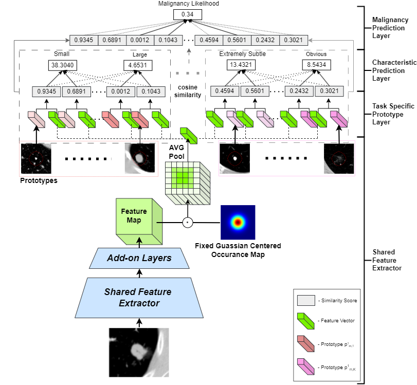

# Hierarchical-XPNet
Explainable Machine Learning for Lung Nodule Classification

**Institution:** Imperial College London  
**Author:** Jeremy James Cachia  
**Supervisor:** Dr. C. Qin  

---

## Overview
Early diagnosis through screening is crucial in minimizing Lung Cancer Mortality but presents significant challenges. Over the past decade, artificial intelligence (AI) has made substantial contributions in the field. However, their black-box nature hinders their adoption in critical healthcare settings where transparency and accountability are essential. 

The propoposed model aims to address these concerns by intrinsically being a highly interpretable AI model that mirrors the diagnostic process of radiologists while providing clear explanations.

## Contributions

- **Hierarchical Prototypical Structure:** This proposed structure provides detailed explanations. The Nodule is first compared against relevant prototypes of Nodule features for similarity scores. These scores are then aggregated to determine an overall malignancy score. This enhances both accuracy and interpretability.
- **Novel Focused Feature Analysis:** A Fixed Occurrence Map is used to direct the model’s attention to the central nodule region, reducing interference from noise, enhancing the relevance of learned prototypes.

## Model Architecture

The proposed Hierarchical-XPNet is an **inherently explainable hierarchical structure**. Rather than mapping a raw CT slice directly to a high-level malignancy classification, it breaks down the diagnosis sequentially:

1. **Shared Feature Extractor & Add-on Layers:** A pre-trained feature extractor and add-on layers serve as the backbone and extract the deep latent feature map from the input CT image.
2. **Fixed Gaussian Centered Occurrence Map:** The extracted feature map is multiplied element-wise by a spatial Gaussian mask. This centers focus directly on the localised nodule, removing focus from irrelevant background lung tissue or imaging features.
3. **Task-Specific Prototype Layer:** The masked feature maps are average-pooled and compared against learned prototype vectors ($p_{m,k}^1$ to $p_{m,K}^1$) using cosine similarity.
4. **Characteristic Prediction Layer:** The resulting similarity scores are aggregated to classify low-level radiological characteristics (e.g., Sphericity, Margin, Texture, Subtlety, and Diameter).
5. **Malignancy Prediction Layer:** These low-level clinical predictions are passed to a final classification layer to produce an explainable Malignancy Likelihood score.

  

Thus this model aims to offer a clear explanation to the diagnosis of a nodule by offering examples while using a thought process similar to that of radiologists, *This appears malignant because it resembles a large.. and malignant.. nodule.*

---

## Project Structure

